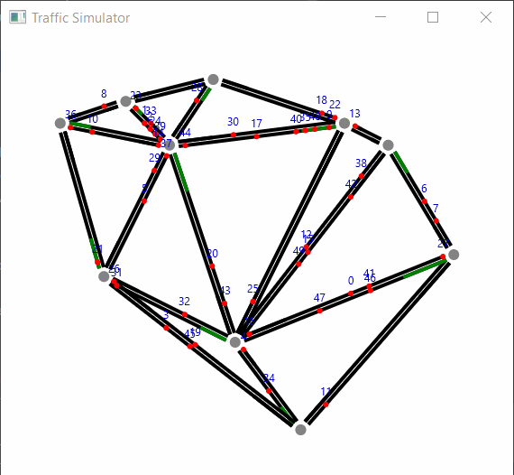

# Traffic Simulator

##### by Rafał Mucha & Piotr Janczyk

---

---

#### Used libraries:

* Akka Actor
* Akka Stream
* Scalaz
* ScalaFx, JavaFx
* A 2D Delaunay Triangulation Library for Java

#### Open-source licences

This application contains and uses the following library:
<pre>
<a href="http://jdiemke.github.io/delaunay-triangulator/">A 2D Delaunay Triangulation Library for Java</a>
Copyright (c) 2015 Johannes Diemke
Available under The MIT Licence
</pre>
